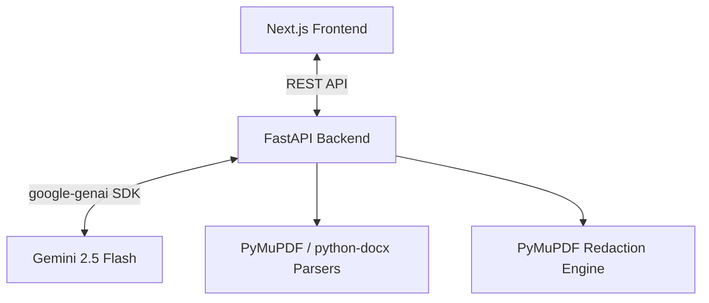

# TrustLens 🔍

> "Privacy you can verify. Instead of asking users to trust AI, we prove that the document is safe."

TrustLens is a production-grade, AI-powered document anonymization and PII detection assistant built to solve the "black box" trust gap. Designed for compliance officers, risk analysts, and security-conscious professionals, TrustLens makes every PII redaction decision transparent, explainable, and verifiable.

---

## 📖 Table of Contents
1. [Project Overview & Vision](#-project-overview--vision)
2. [Key Features](#-key-features)
3. [System Architecture](#%EF%B8%8F-system-architecture)
4. [Folder Structure](#-folder-structure)
5. [Technology Stack](#-technology-stack)
6. [Local Environment Setup](#-local-environment-setup)
7. [API Documentation](#-api-documentation)

---

## 🌟 Project Overview & Vision

### The Problem
Automated document anonymizers operate as black boxes. When a file is scrubbed, users are presented with a redacted output without any explanation of *why* specific information was hidden, or *why other text was left visible*. Because of this, compliance officers must manually review every single word of the output, rendering automation obsolete.

### Our Solution
TrustLens establishes **Trust & Explainability** as first-class citizens. By integrating secure, modern document parsers with advanced Gemini LLM semantic reasoning, we provide:
* **Explainability Logs**: Click any redacted token to inspect *why* it was classified as PII, along with match confidence, risk level, and suggestions.
* **Omission Audits ("Why Not This")**: Select any unhighlighted text and ask the AI why it was left visible. If the AI made a mistake, instantly "Mark as Sensitive" to add it to the redaction pipeline.
* **Configurable Privacy Settings**: Adjust confidence thresholds dynamically, swap highlight visual themes, and toggle auto-redaction rules.
* **Compliance Privacy Reports**: Generate and download complete audit reports (JSON/PDF) listing all identified PII risk metrics.

---

## 🛠️ System Architecture

TrustLens is designed following clean architecture guidelines. Data is processed ephemerally completely in-memory and deleted post-session.



---

## 📂 Folder Structure

The repository is organized as a clean, unified workspace containing the Next.js frontend and the FastAPI Python backend:

```text
TrustLens/
├── backend/                  # FastAPI Backend API Server
│   ├── main.py               # API Routing and Controller Endpoints
│   ├── gemini_client.py      # Gemini 2.5 Flash SDK Integration Client
│   ├── parsers.py            # PDF/DOCX/TXT Parsers (size/mime/encryption checks)
│   ├── redactor.py           # Native PDF / Document Redaction Engine
│   ├── models.py             # Pydantic v2 schemas and records
│   ├── session_store.py      # Ephemeral thread-safe session store
│   └── requirements.txt      # Python backend dependencies
├── src/                      # Next.js Frontend Application
│   ├── app/                  # App Router pages (sandbox, review)
│   ├── components/           # Reusable UI & Layout Components
│   ├── services/             # API client layer (api.ts)
│   └── types/                # Unified TypeScript interfaces
├── docs/                     # Sprint documentation and diagrams
└── package.json              # Monorepo configuration
```

---

## 💻 Technology Stack

* **Frontend**: Next.js 15, React 19, TypeScript, Tailwind CSS, Shadcn UI, Framer Motion, Lucide React.
* **Backend**: FastAPI, Python 3.11, Pydantic v2, Uvicorn.
* **AI Layer**: Gemini 2.5 Flash (`google-genai` SDK).
* **Document Processing**: PyMuPDF (fitz), python-docx.

---

## 🚀 Local Environment Setup

### Prerequisites
* Node.js v18+ & npm v10+
* Python 3.11+

### Step-by-Step Installation

1. **Clone the Repository**:
   ```bash
   git clone https://github.com/Akhils696/TrustLens-Sprint-Four-Hack.git
   cd TrustLens-Sprint-Four-Hack
   ```

2. **Frontend Setup**:
   Install dependencies and run the Next.js development server from the monorepo root:
   ```bash
   npm install
   npm run dev
   ```
   *The frontend will run at `http://localhost:3000`.*

3. **Backend Setup**:
   Create a virtual environment and launch the FastAPI server from the `backend/` folder:
   ```bash
   cd backend
   python -m venv venv
   # On Windows:
   venv\Scripts\activate
   # On macOS/Linux:
   source venv/bin/activate

   pip install -r requirements.txt
   python -m uvicorn main:app --reload --port 8000
   ```
   *The API will run at `http://localhost:8000`. You can inspect endpoints at `http://localhost:8000/docs`.*

4. **Environment Variables Configuration**:
   Create a `.env` file in the `backend/` folder:
   ```env
   GEMINI_API_KEY=your_gemini_api_key_here
   ```

---

## 🔌 API Documentation

| Endpoint | Method | Purpose |
|---|---|---|
| `/api/upload` | `POST` | Upload and validate documents (PDF/DOCX/TXT), returns extracted text. |
| `/api/analyze` | `POST` | Triggers Gemini PII detection and returns confidence & risk levels. |
| `/api/explain` | `POST` | Generates AI semantic explainability reasoning for a specific token. |
| `/api/why-not` | `POST` | Resolves false negatives by explaining why a visible word was omitted. |
| `/api/review` | `POST` | Syncs manual user approval/rejection state back to the session. |
| `/api/redact` | `POST` | Generates permanent redacted document paths. |
| `/api/download/{id}` | `GET` | Serves the redacted PDF or TXT document download. |
| `/api/report/{id}` | `GET` | Returns the complete compliance privacy report JSON. |
| `/api/health` | `GET` | Checks backend engine health status. |
