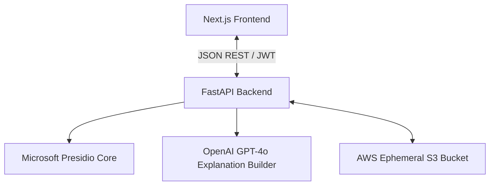

# TrustLens 🔍

> "Trust Lens: Instead of asking users to trust AI, we prove that the document is safe."

TrustLens is an AI-powered document anonymization and PII detection assistant built to solve the "black box" trust gap. Designed for compliance officers, risk analysts, and security-conscious professionals, TrustLens makes every PII redaction decision transparent, explainable, and verifiable.

---

## 📖 Table of Contents
1. [Project Overview & Vision](#-project-overview--vision)
2. [Key Product Pillars](#-key-product-pillars)
3. [System Architecture](#%EF%B8%8F-system-architecture)
4. [Monorepo Folder Structure](#-monorepo-folder-structure)
5. [Technology Stack](#-technology-stack)
6. [Local Environment Setup](#-local-environment-setup)
7. [Product Roadmap](#-product-roadmap)

---

## 🌟 Project Overview & Vision

### The Problem
Automated document anonymizers operate as black boxes. When a file is scrubbed, users are presented with a redacted output without any explanation of *why* specific information was hidden, or *why other text was left visible*. Because of this, compliance officers must manually review every single word of the output, rendering automation obsolete.

### Our Solution
TrustLens establishes **Trust & Explainability** as first-class citizens. By integrating pattern matchers with advanced NLP reasoning, we provide:
* **Dual-Reasoning Explanations**: Hover over any redacted word to see *why* it was hidden, and hover over surrounding text to understand *why* it was left visible.
* **Interactive Verification Studio**: A side-by-side workspace to approve, override, or edit PII classifications in real-time.
* **Safe-to-Share Audit Reports**: A downloadable compliance record detailing every decision and user override, complete with file hashes (SHA-256) for auditability.

---

## 🛠️ System Architecture

TrustLens is designed following **Clean Architecture** principles, separating presentation interfaces, business logic components, and third-party AI drivers.



### Key Security Flow (Zero-Retention Model)
1. **Upload**: User uploads a document.
2. **Processing**: Document is ephemerally cached, parsed, and analyzed for PII.
3. **Reasoning**: Entities are mapped to explanations and confidence scores.
4. **Export**: The redacted document and verification report are compiled.
5. **Sanitization**: Ephemeral caches are immediately deleted from servers and S3 storage, keeping data in the customer's hands.

---

## 📂 Monorepo Folder Structure

TrustLens is built as a workspace-based monorepo allowing concurrent work across frontend and backend services:

```text
trustlens/
├── apps/                     # High-level applications
│   ├── web/                  # Next.js 14 Frontend Application
│   └── api/                  # FastAPI Backend API Server
├── packages/                 # Shared configurations and common modules
│   ├── ui/                   # Shared React design system components
│   └── types/                # Unified TypeScript interface models
├── docs/                     # Sprint 0 Core Foundation Documentation
│   ├── Architecture.md
│   ├── CodingStandards.md
│   ├── FeaturePriority.md
│   ├── FunctionalRequirements.md
│   ├── GitWorkflow.md
│   ├── InformationArchitecture.md
│   ├── NonFunctionalRequirements.md
│   ├── ProblemStatement.md
│   ├── ProductVision.md
│   ├── TechStack.md
│   └── UserPersona.md
└── README.md                 # Project root README.md (This file)
```

For detailed specifications on each layer, refer to the [Folder Structure Docs](file:///c:/Users/Akhil's-OMEN/Desktop/Sprint%20four/docs/FolderStructure.md).

---

## 💻 Technology Stack

* **Frontend**: Next.js 14 (App Router), React, TypeScript, Zustand, Tailwind CSS, Lucide React icons.
* **Backend**: Python 3.11, FastAPI, Uvicorn, Pydantic v2.
* **AI Layer**: Microsoft Presidio PII Detection Engine, OpenAI GPT-4o API.
* **Deployment**: Vercel (Frontend), AWS ECS Fargate (Backend), AWS S3 (Ephemeral Storage).
* **Testing**: Jest & React Testing Library (Frontend), pytest (Backend).

---

## 🚀 Local Environment Setup

### Prerequisites
* Node.js v18+ & npm v10+
* Python 3.11+
* Docker & Docker Compose (optional)

### Setup Instructions

1. **Clone the Repository**:
   ```bash
   git clone https://github.com/Akhils696/TrustLens-Sprint-Four-Hack.git
   cd TrustLens-Sprint-Four-Hack
   ```

2. **Frontend Installation**:
   ```bash
   cd apps/web
   npm install
   npm run dev
   ```
   *The frontend will run at `http://localhost:3000`.*

3. **Backend Installation**:
   ```bash
   cd apps/api
   python -m venv venv
   source venv/bin/activate  # On Windows use: venv\Scripts\activate
   pip install -r requirements.txt
   uvicorn app.main:app --reload
   ```
   *The backend documentation will run at `http://localhost:8000/docs`.*

---

## 🗺️ Product Roadmap

* **Sprint 0: Product Foundation** (Complete)
  * Establish architecture, vision, folder setup, and coding conventions.
* **Sprint 1: Core Features & Logic Engine** (Next)
  * Implement document parsing (PDF, DOCX, TXT).
  * Build Presidio + GPT-4o orchestration engine.
  * Launch Interactive Review Studio UI.
* **Sprint 2: Security, Auditing & Export** (Final Hackathon Delivery)
  * Implement Safe-to-Share Audit Report generation.
  * Integrate OAuth2 JWT login structures and Guest Mode rules.
  * Run final End-to-End verification and compliance performance sweeps.
