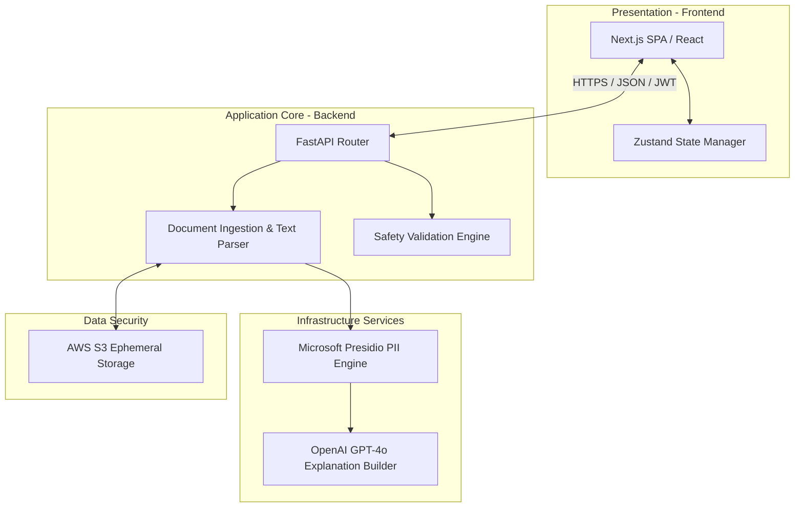
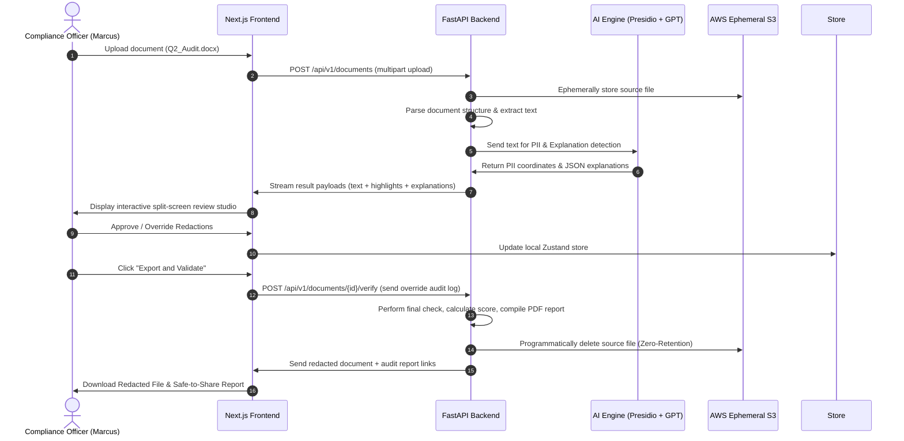

# System Architecture - TrustLens

This document details the high-level and component-level architecture design of TrustLens. It is designed to satisfy clean architecture rules and ensure maximum separation of concerns.

---

## 1. High-Level Architecture Overview

---

## 2. Component Design Details

### A. Frontend (Presentation Layer)
* **Architecture**: Single Page Application structure nested inside Next.js App Router workspace.
* **Responsibilities**:
  * Render document layouts dynamically while preserving relative positioning for highlights.
  * Manage local state via Zustand, tracking active document arrays, highlight options, hover events, and override changes.
  * Perform client-side token coordinate matches to draw redaction rectangles.
  * Local caching of session states for Guest Mode in localStorage.

### B. Backend (Core Business Logic)
* **Architecture**: Clean Architecture structure written in FastAPI.
* **Responsibilities**:
  * **Ingestion Pipeline**: Receive file uploads (PDF, DOCX, TXT), extract textual content, record structural mappings (page positions, word spans), and standardizes file payloads.
  * **Validation Service**: Run final validation checks (verifying that no PII remains in unmasked sections) and compute safety scores.
  * **Report Builder**: Synthesize the Safe-to-Share audit document by combining original text snippets, final statuses, explanations, and SHA-256 hashes.

### C. AI Layer (PII & Explainability Infrastructure)
* **First Pass - Detection**: Microsoft Presidio scans the text. Presidio uses custom regex pattern registries (for Government IDs, Credit Cards) and SpaCy NER models (for names, places). Output is a list of candidate PII coordinates, entity types, and raw confidence values.
* **Second Pass - Reasoning & Explanations**: GPT-4o evaluates the context of each candidate. It determines:
  * If the detection is a false positive (and writes the explanation for unmasking it).
  * If the detection is a true positive (and writes the rationale explaining why).
  * Synthesizes explanations in standardized JSON structures.

### D. Ephemeral Storage
* **Architecture**: AWS S3 private buckets.
* **Security Control**: Zero-retention configuration. Documents are cached only during active parsing and processing runs. S3 objects have a lifecycle rule set to immediately expire, and files are explicitly deleted programmatically via API once the session exports results or terminates.

### E. Communication Protocol
* **REST API**: Standard JSON REST endpoints over HTTPS for document ingestion, review, and report retrieval.
* **Streaming Responses**: Server-Sent Events (SSE) or WebSockets used during AI processing to stream parsing status updates back to the UI in real-time.

---

## 3. Data & Security Flow Diagrams

### End-to-End Processing Sequence

### Security Flow Details
1. **Transport Encryption**: All client-server payloads are encrypted using **TLS 1.3**.
2. **Access Control**: Authenticated requests must pass a valid OAuth2 Bearer JWT. Guest Mode operations are restricted by IP rate-limiting, and payloads are limited to 1MB.
3. **Data Sanitization**: Prior to running GPT-4o semantic explanation, raw text is sent through local pattern scrubbing to prevent leaking data during explainability analysis. The AI layer receives isolated text windows rather than full files, reducing data residency footprints.
4. **Cryptographic Signatures**: The exported Safe-to-Share Report contains a SHA-256 hash of both the original document and the final redacted document, allowing third parties to prove that the document they received matches the verified audit log.
