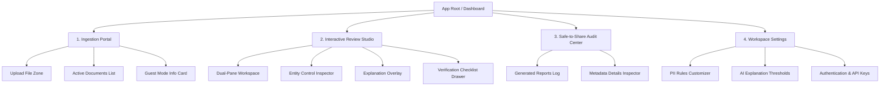

# Information Architecture - TrustLens

This document maps out the navigation tree, page structure, and content hierarchy of the TrustLens application.

---

## 1. Global Navigation Tree

---

## 2. Page Hierarchy & Content Layout

### 1. Main Dashboard & Ingestion Portal (Root)
* **Path**: `/` or `/dashboard`
* **Purpose**: Primary gateway for Marcus to upload new documents and manage ongoing redaction tasks.
* **Key Components**:
  * **Unified Drag-and-Drop Uploader**: Central widget accepting PDF, DOCX, and TXT.
  * **Recent Documents Table**: List of active files with headers: File Name, Size, Status (Processing, In Review, Ready to Export), Safety Score, and Date Uploaded.
  * **User Profile Widget**: Displays user state (Authenticated vs. Guest Banner).
  * **Navigation Sidebar**: Persistent navigation panel providing quick shortcuts to other pages.

### 2. Interactive Review Studio
* **Path**: `/studio/[document_id]`
* **Purpose**: Interactive playground where Marcus audits the AI redaction choices.
* **Key Components**:
  * **Original Pane**: Left panel rendering the source text with visual highlights for detected PII. Hovering over a word displays the classification tooltip.
  * **Redacted Pane**: Right panel displaying the real-time masked document. Text marked as redacted is blacked out.
  * **Side Control Panel**:
    * **Entity Legend**: Toggle highlights of specific PII types (e.g., hide/show Phone highlights).
    * **Threshold Slider**: Real-time slider to change the confidence limit for auto-redaction (0% to 100%).
    * **Document Safety Meter**: Radial chart displaying the safety score (0-100%).
  * **Explanation Overlay Modals**:
    * Context card showing model reasoning, token match statistics, and action toggles.
  * **Verification Checklist Drawer**:
    * List of warnings (e.g., "3 items match credit card format but were left visible by the user").

### 3. Safe-to-Share Audit Center
* **Path**: `/audit-center`
* **Purpose**: Storage of historical runs and verification logs.
* **Key Components**:
  * **Audit Log Table**: File list showing exported files, their cryptographic hashes (SHA-256), and links to download corresponding reports.
  * **Metadata Detail Inspector**: Expandable row showing review metrics (e.g., "12 entities flagged, 2 edits, review duration: 1m 45s").

### 4. Workspace Settings
* **Path**: `/settings`
* **Purpose**: Adjust detection models, entity lists, and account setups.
* **Key Components**:
  * **PII Detection Profiles**: Enable/disable specific checkers (e.g., turn off location checking for domestic contracts).
  * **Confidence Level Thresholds**: Default starting threshold (preset to 80%).
  * **API Keys & Integrations**: Integration setup for enterprise LLM endpoints (e.g., custom OpenAI API key).
  * **Security Profile**: Password modifications, MFA setups, and session inactivity timer config.
