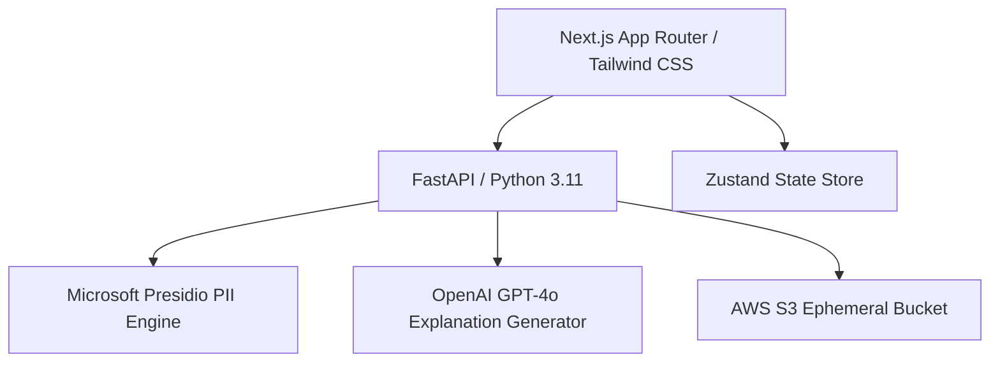

# Technology Stack Specifications - TrustLens

This document outlines the selected technology stack for TrustLens, detailing the rationale behind each choice.

---

## 1. Core Stack Components

### 1. Frontend Layer
* **Framework**: **Next.js 14 (App Router)**
  * *Rationale*: Offers excellent performance via React Server Components (RSC), built-in API routing capabilities for simple endpoints, and robust developer tooling.
* **Language**: **TypeScript (v5.x)**
  * *Rationale*: Ensures full type safety across components, layouts, and data fetchers, minimizing run-time errors in critical views.
* **Styling**: **Tailwind CSS (v3.x)** & **Vanilla CSS**
  * *Rationale*: Provides utility-first styling for fast prototyping. Custom animations (e.g., hover cards, slider animations, blur transitions) will be handled with Tailwind class extensions or custom transition classes.
* **Icons & Components**: **Lucide React** (icons) + **Radix UI Primitives** (headless accessible primitives for dropdowns, sliders, and tooltip modals).

### 2. Backend Layer
* **Language & Runtime**: **Python 3.11**
  * *Rationale*: Required for integration with NLP libraries (Presidio) and AI frameworks.
* **Framework**: **FastAPI**
  * *Rationale*: High performance (asynchronous ASGI), native Pydantic integration for data validation, and auto-generated OpenAPI documentation.
* **Server**: **Uvicorn** (ASGI server wrapper).

### 3. Artificial Intelligence & NLP Layer
* **PII Detection Engine**: **Microsoft Presidio**
  * *Rationale*: Open-source, production-grade, pattern-based and model-based PII detection. Uses a mixture of custom regex patterns and SpaCy NER models, providing low-latency first-pass scanning.
* **Explanation & Analysis Engine**: **OpenAI GPT-4o API**
  * *Rationale*: Provides high-accuracy semantic analysis. It determines context (e.g., why a matched name is NOT PII, or why a credit card number is a test pattern) and structures explanations in plain English.
* **Orchestration**: **LangChain / Custom API wrappers** with strict Pydantic JSON validation schemas.

### 4. State Management
* **Frontend State**: **Zustand**
  * *Rationale*: Lightweight, boilerplate-free state management library. Perfect for tracking document states, original-to-redacted mapping tables, tooltips, and active reviewer edits.
* **AI Stream Context**: Standard **React Context API** for transient UI states (e.g., dropdown toggle configurations, theme configs).

### 5. Testing Frameworks
* **Frontend**: **Jest** + **React Testing Library**
  * *Rationale*: Industry-standard for unit-testing components, hook logic, and rendering behavior.
* **Backend**: **pytest** + **HTTPX** (for async client mock runs).
  * *Rationale*: Simple, readable, and highly functional framework for API integration testing and pipeline processing verification.

### 6. Infrastructure & Deployment
* **Frontend Deployment**: **Vercel**
  * *Rationale*: Automatic scaling, global CDN, and native support for Next.js preview deployments.
* **Backend Deployment**: **AWS ECS (Fargate)**
  * *Rationale*: Serverless container orchestration. Fits standard enterprise compliance limits since it runs isolated Docker containers within a secure VPC.
* **Object Storage**: **AWS S3**
  * *Rationale*: Serves as a secure, ephemeral upload landing bucket. Ephemeral files are automatically deleted after processing using S3 Lifecycle Rules (configured for immediate deletion upon transaction closing).

### 7. Developer Tooling & Linters
* **Formatting**: **Prettier** (Frontend) + **Black** / **Ruff** (Backend).
* **Linting**: **ESLint** (Frontend) + **Ruff** (Backend).
* **Environment Control**: **Docker** & **Docker Compose** (for standardizing local testing runtimes of backend and frontend).
