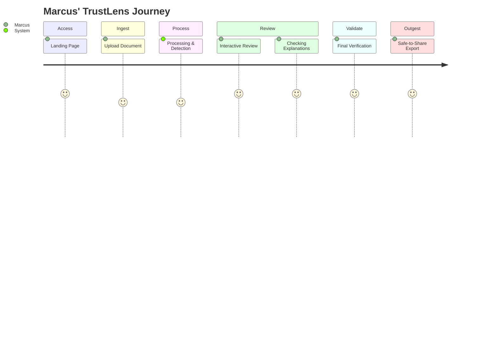

# User Journey Map - TrustLens

This document maps Marcus’ user journey step-by-step as he uses TrustLens to anonymize documents and verify the safety of data prior to submitting to external AI engines.

---

## User Journey Stages

### Stage 1: Landing (Entry Point)
* **User Action (Marcus)**: Navigates to `trustlens.io` using his browser. He sees a clean, professional, fintech-tailored dashboard landing page explaining how the tool makes data scrubbing transparent.
* **System Response**: Displays options to log in (authenticated mode) or proceed to the sandbox sandbox (Guest Mode).
* **Marcus' Goal**: Quickly determine if the tool looks enterprise-ready and compliant, and enter the workspace.
* **Feelings/Mindset**: Skeptical but curious. Hoping this will save him hours of manual work.
* **Key Screen Elements**: Value proposition statement, "Enter Sandbox (Guest Mode)" button, "Log In / Register" button, security credentials badge section.

---

### Stage 2: Upload (Ingestion)
* **User Action (Marcus)**: Clicks "Upload Document" and drags and drops an internal financial report (`Q2_Operational_Audit.docx`, 4MB).
* **System Response**: Validates file signature, extracts text, displays a file upload progress bar, and confirms document support.
* **Marcus' Goal**: Upload his active document without formatting loss or security leaks.
* **Feelings/Mindset**: Anxious about where the data is stored.
* **Key Screen Elements**: Drag-and-drop zone, file size/format validator, security assurance indicator ("Zero Retention Active").

---

### Stage 3: Processing (Data Ingestion Pipeline)
* **User Action (Marcus)**: Waits for the processing to finish (takes ~2 seconds).
* **System Response**: The backend parses the DOCX file, runs the Presidio PII Detection Engine to identify candidate entities, and invokes the OpenAI GPT-4o Explanation Builder to generate explanations for each classification.
* **Marcus' Goal**: Wants fast processing and correct classification.
* **Feelings/Mindset**: Patient but expects a high level of accuracy.
* **Key Screen Elements**: Animated progress ring, "Analyzing syntax and scanning context..." status line.

---

### Stage 4: Detection (Visual Highlighting)
* **User Action (Marcus)**: Views the processed document rendered in the split-pane workspace.
* **System Response**: Highlights all detected entities in different colors (red for Name, green for SSN, yellow for Financial Account). Masked fields show blacked-out text on the right pane.
* **Marcus' Goal**: Understand at a glance what was detected.
* **Feelings/Mindset**: Impressed by the visual indicators, but starts looking for missed details.
* **Key Screen Elements**: Highlighted entity tags in-line, Side-by-side split pane (Original vs. Redacted).

---

### Stage 5: Review (Interactive Verification)
* **User Action (Marcus)**: Clicks on a highlighted name (e.g., "Akhil S") in the left pane to check if it's correct. He also scrolls down to check areas that were *not* highlighted to ensure no leaks occurred.
* **System Response**: Interactive overlay opens showing why the token was classified or why surrounding tokens were ignored.
* **Marcus' Goal**: Confirm the AI's classification is correct.
* **Feelings/Mindset**: In control. This is the first time he can see *why* the tool made a choice.
* **Key Screen Elements**: Highlighting controls, side-by-side scroll alignment.

---

### Stage 6: Explanation (Explainability Tooltip)
* **User Action (Marcus)**: Inspects the tooltip description for "Akhil S" and reads: *"Flagged as Name: matched the structure of a customer sign-off block in the document header."* He also hovers over a visible string "OpenAI API" and reads: *"Left visible: identified as software service provider name, not a personal identifier."*
* **System Response**: Displays the token-level confidence score (94%) and the reasoning path.
* **Marcus' Goal**: Validate the AI's reasoning.
* **Feelings/Mindset**: Trusting. The explanation is logical and matches his human compliance training.
* **Key Screen Elements**: Context explanation tooltip card, Confidence level progress meter, Action triggers (Approve / Reject).

---

### Stage 7: Verification (Final Compliance Check)
* **User Action (Marcus)**: Toggles one false positive (unmasks a product version number that looked like a ZIP code) and approves the rest. He clicks "Run Final Audit."
* **System Response**: Evaluates the document's final state, recalculates the Document Safety Score, confirms 100% check status, and locks the review panel.
* **Marcus' Goal**: Double-check that the document has been fully vetted.
* **Feelings/Mindset**: Relieved. The safety score is 100% and he knows nothing was missed.
* **Key Screen Elements**: "Document Safety: 100% Verified" indicator badge, "Run Audit Summary" button.

---

### Stage 8: Export (Outgest & Reporting)
* **User Action (Marcus)**: Clicks "Export Document" and downloads the Redacted PDF along with the "Safe-to-Share Report".
* **System Response**: Generates the redacted PDF with solid black bars replacing text, compiles the PDF audit report, and deletes the ephemeral upload files from the server.
* **Marcus' Goal**: Obtain the files to share with ChatGPT and file the compliance report in his internal database.
* **Feelings/Mindset**: Satisfied and productive. He completed in 3 minutes what normally takes 2 hours, with an audit log to prove it.
* **Key Screen Elements**: Export confirmation dialog, Download links for files (Redacted PDF, Safe-to-Share audit report).
