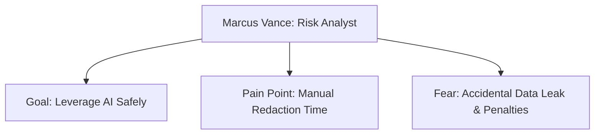

# User Persona - Marcus (The Security-Conscious Risk Analyst)

## 1. Profile Summary
* **Name**: Marcus Vance
* **Role**: Senior Compliance Officer & Risk Analyst
* **Organization**: Apex Financial Services (a mid-sized fintech startup)
* **Age**: 34
* **Experience**: 7 years in risk management and corporate compliance

## 2. Background & Experience
Marcus holds a Master’s degree in Regulatory Compliance and has spent his career auditing operational risks in financial institutions. At Apex Financial Services, he is responsible for reviewing external data requests, auditing operational procedures, and clearing documents for research purposes. Over the last year, his department has been under intense pressure to adopt LLM tools (such as ChatGPT and proprietary API endpoints) to summarize large regulatory files, analyze customer feedback trends, and synthesize financial statements.

## 3. Technical Knowledge
* **General IT**: Highly proficient. He comfortable working with SaaS platforms, enterprise document management systems (DMS), and data visualization dashboards.
* **AI & LLMs**: Intermediate. He understands how LLMs work, including prompt engineering, context windows, and token usage. However, he is acutely aware of the data leakage risks associated with sending inputs to cloud-hosted APIs and knows that public terms of service may allow providers to train models on user inputs.
* **Security & Privacy Concepts**: Advanced. Marcus is fully versed in GDPR, CCPA, HIPAA, SOC2 compliance frameworks, data masking methodologies, tokenization, and encryption standards.

## 4. Goals & Aspirations
* **Accelerate Audit Cycle Time**: Reduce the time spent summarizing external regulatory documentation using generative AI.
* **Guarantee Data Safety**: Achieve absolute certainty that no customer Names, Social Security Numbers (SSNs), Credit Card Numbers (PANs), or proprietary financial accounts are sent to external LLMs.
* **Systematize Redaction Reports**: Generate structured, exportable "Safe-to-Share Reports" for every document processed, creating an audit log to prove compliance with data privacy policies.

## 5. Motivations
* **Efficiency & Innovation**: Marcus wants to be the pioneer in his firm who successfully and safely integrates AI into compliance workflows, boosting department productivity by 3x.
* **Risk Mitigation**: He is motivated by the desire to build a robust, error-proof process that eliminates human error during document scrubbing.
* **Career Growth**: Establishing himself as an AI-compliance expert within fintech is key to his long-term career progression.

## 6. Pain Points & Frustrations
* **Black-Box AI Redactors**: He has tried automated PII scrubbers but refuses to use them because they offer no rationale. When they miss a name or redaction, he cannot understand why.
* **High Rate of Over-Redaction**: Automated tools often redact standard terms, formatting symbols, or generic business contexts (like dates or non-PII financial amounts), which destroys the semantic structure of documents and makes the resulting LLM outputs useless.
* **Manual Scrubbing Exhaustion**: Currently, Marcus spent 4-5 hours a day manually reading text files and copying them line-by-line to redact names, forcing him to act as a human data scrubber rather than doing analytical risk work.

## 7. Fears
* **Corporate Privacy Breaches**: A single accidental leak of a high-net-worth client's financial details to public LLM endpoints could trigger a regulatory investigation, massive GDPR fines (up to 4% of global turnover), and severe reputational damage.
* **Loss of Employment**: Being held personally responsible for a critical security leak that damages the firm's credibility.
* **Regulatory Audits**: Failing a SOC2 or GDPR audit because of a lack of clear documentation showing how sensitive data is filtered before leaving the company server.

## 8. Daily Workflow

### Phase 1: Intake & Assessment (9:00 AM - 10:30 AM)
Marcus receives a batch of 5 to 10 incoming documents (mix of PDFs, DOCX agreements, and TXT outputs) containing customer complaints, operational audit summaries, and legal briefs. He identifies which documents need to be analyzed by the team's shared AI research assistant.

### Phase 2: Manual Data Masking (10:30 AM - 1:30 PM)
Because automated solutions are untrustworthy, Marcus opens each document side-by-side with a text editor. He reads the files, manually replacing names with `[REDACTED_NAME_1]`, dates with `[REDACTED_DATE]`, and account numbers with `[REDACTED_ACCT]`. He is constantly paranoid that he will miss an occurrence buried deep in page 34 of a contract.

### Phase 3: AI Analysis & Verification (1:30 PM - 3:30 PM)
Marcus copies the manually scrubbed text and inputs it into the corporate ChatGPT workspace. He reviews the summaries and extracts key insights. If he notices that some customer identifiers were missed in the previous phase, he must start over, delete the prompt history, and re-sanitize the file.

### Phase 4: Compliance Logging (3:30 PM - 5:00 PM)
He documents the source of the file, the purpose of the AI query, and logs the manual redaction steps in an internal spreadsheet to maintain a record for future SOC2 audits.
