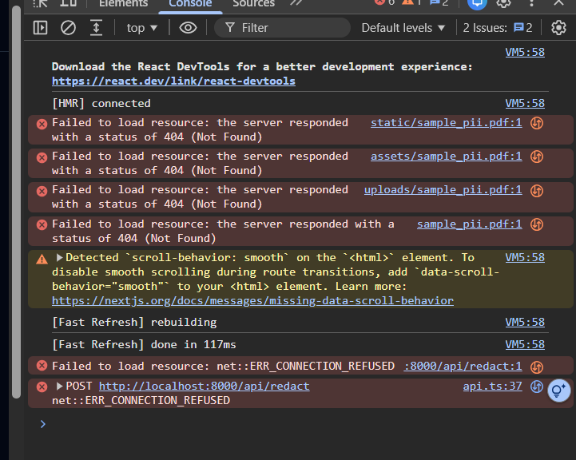
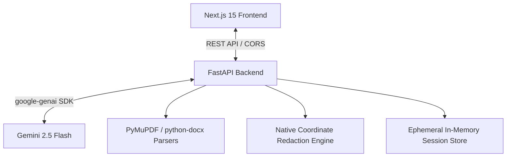

# TrustLens 🔍 — Product Writeup & Implementation Details

TrustLens is a production-grade, AI-powered document anonymization and PII detection assistant built to solve the "black box" trust gap in automated compliance. By making every PII redaction transparent, explainable, and verifiable, TrustLens empowers risk analysts, compliance officers, and security professionals to automate document scrubbing with absolute confidence.

---

## 📸 Product Interface

Here is a visual overview of the TrustLens interactive review dashboard in action:

---

## 🎯 Problem Statement & Core Value Proposition

### The "Black Box" Trust Gap
Automated document anonymizers operate as black boxes. When a document is scrubbed, users are presented with redacted text or black blocks without any explanation of *why* specific information was hidden, or *why other sensitive text was left visible*. Consequently, compliance officers must manually review every single word of the output, rendering automation obsolete.

### Our Solution: Verifiable Privacy
TrustLens establishes **Trust & Explainability** as first-class citizens. By integrating secure, modern document parsers with advanced Gemini LLM semantic reasoning, we provide:
* **Interactive Highlight Mapping**: Real-time visual synchronization of detected PII.
* **Explainability Logs**: Click any redacted token to inspect *why* it was classified as PII, along with match confidence, risk level, and suggestions.
* **Omission Audits ("Why Not This")**: Select any unhighlighted text and ask the AI why it was left visible. If the AI made a mistake, instantly "Mark as Sensitive" to add it to the redaction pipeline.
* **Zero-Retention Security**: In-memory ephemeral processing where files are scrubbed and permanently deleted immediately after they are served.

---

## ⚙️ Technical Architecture & Workflow

TrustLens is built on a clean, modern decoupled architecture. The frontend is built on Next.js 15 (React 19) and Tailwind CSS, while the backend is powered by FastAPI, PyMuPDF, and the Gemini 2.5 Flash SDK.

### 1. The Processing Pipeline
1. **Upload & Validate**: The FastAPI backend parses PDFs, Word (`.docx`), and text (`.txt`) documents, performing size checks (max 20MB), MIME verification, and encrypted PDF detection.
2. **Analyze**: The backend uses Gemini 2.5 Flash with structured schema generation to detect Name, Phone, Aadhaar, PAN, Bank Details, and Emails, calculating an overall **Privacy Score**.
3. **Review & Audit**: The frontend displays the text with interactive highlights. Users audit the decisions using the Explainability and Omission Audit panels.
4. **Redact & Download**: Detections are applied natively as coordinate black-box redactions (for PDFs) or structural text replacements (for Word/Text), rendering a completely clean output for download.

---

## 🛠️ Sprint 7 Release Candidate & Critical Bug Fixes

To prepare TrustLens for production release, several critical issues were resolved to ensure robustness, compliance, and clean page-flow navigation:

### 1. Download Filename Mapping (UUID Fix)
* **Issue**: The browser downloaded redacted files with internal backend UUIDs (e.g., `117b979f-7d59-4088-a5de-38861b6df0c8`) instead of the original, human-readable name (e.g., `contract_redacted.pdf`).
* **Fix**: Configured explicit headers mapping in the `GET /api/download/{document_id}` endpoint. Also, updated `CORSMiddleware` in `main.py` with `expose_headers=["Content-Disposition"]` so that the client-side JavaScript can read the `filename` parameter and trigger a clean download.

### 2. Zero-Retention Ephemeral File Cleanup
* **Issue**: Exported redacted PDFs stayed on the backend server, presenting a potential compliance and data leakage vulnerability.
* **Fix**: Implemented FastAPI's `BackgroundTasks` to invoke a deletion utility immediately *after* the `FileResponse` streams the file to the client. This guarantees that files exist only for the duration of the download and are instantly removed without locking the filesystem.

### 3. Navigation Integrity
* **Issue**: Action buttons allowed users to navigate directly to raw FastAPI endpoints or resulted in broken interface redirect loops.
* **Fix**: Standardized the frontend page-flow routing in `src/app/review/page.tsx`, updating the final completion state checks to redirect safely inside the React container.

---

## 💻 Tech Stack & Dependencies

* **Frontend**: Next.js 15 (React 19), TypeScript, Tailwind CSS, Shadcn UI, Framer Motion, Lucide React.
* **Backend**: FastAPI, Python 3.11, Pydantic v2, PyMuPDF (fitz), python-docx.
* **LLM Engine**: Google Gemini 2.5 Flash (`google-genai` SDK).
